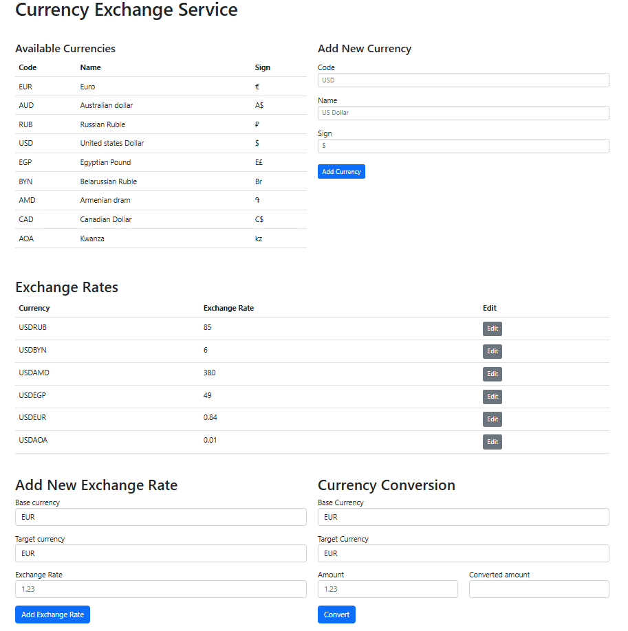

---
Currency Exchange Service
---

REST API проект, имитирующий реализацию сервиса обмена валют, написанный с помощью шаблона проектирования MVC.
В данном сервисе можно добавлять новую валюту, добавлять курс на основе существующих уже валют, изменять курс этих валют и конечно же 
совершать процедуру конвертирования из одной валюты в другую для получения денежной суммы.

---
**Основная мотивация проекта**
- Знакомство с MVC
- SQL - базовый синтаксис, создание таблиц
- REST API - правильное именование ресурсов, использование HTTP кодов ответа
- Java Servlets.
- Deploy
___

**Стек**
- Java 17.0.15.
- Tomcat 10.1.41
- Apache Maven 3.9.9
- SQLite3 3.50.1
- JDBC-3.34.0
___
## Описание REST API
**GET** ```/currencies```

Получение списка валют. Пример ответа:

```
[
    {
        "id": 0,
        "name": "United States dollar",
        "code": "USD",
        "sign": "$"
    },   
    {
        "id": 0,
        "name": "Euro",
        "code": "EUR",
        "sign": "€"
    }
]
```
HTTP коды ответов:
- Успех - 200
- Ошибка (например, база данных недоступна) - 500

**GET** ```/currency/EUR```

Получение конкретной валюты. Пример ответа:
```
{
    "id": 0,
    "name": "Euro",
    "code": "EUR",
    "sign": "€"
}
```
HTTP коды ответов:
- Успех - 200
- Код валюты отсутствует в адресе - 400
- Валюта не найдена - 404
- Ошибка (например, база данных недоступна) - 500

**POST** ```/currencies```

Добавление новой валюты в базу. Данные передаются в теле запроса в виде полей формы ```(x-www-form-urlencoded)```. Поля формы - ```name, code, sign```. Пример ответа - JSON представление вставленной в базу записи, включая её ID:
```
{
    "id": 0,
    "name": "Euro",
    "code": "EUR",
    "sign": "€"
}
```
HTTP коды ответов:
- Успех - 201
- Отсутствует нужное поле формы - 400
- Валюта с таким кодом уже существует - 409
- Ошибка (например, база данных недоступна) - 500

**Обменные курсы**

**GET** ```/exchangeRates```

Получение списка всех обменных курсов. Пример ответа:
```
[
    {
        "id": 0,
        "baseCurrency": {
            "id": 0,
            "name": "United States dollar",
            "code": "USD",
            "sign": "$"
        },
        "targetCurrency": {
            "id": 1,
            "name": "Euro",
            "code": "EUR",
            "sign": "€"
        },
        "rate": 0.99
    }
]
```
HTTP коды ответов:
- Успех - 200
- Ошибка (например, база данных недоступна) - 500

**GET** ```/exchangeRate/USDRUB```

Получение конкретного обменного курса. Валютная пара задаётся идущими подряд кодами валют в адресе запроса. Пример ответа:
```
{
    "id": 0,
    "baseCurrency": {
        "id": 0,
        "name": "United States dollar",
        "code": "USD",
        "sign": "$"
    },
    "targetCurrency": {
        "id": 2,
        "name": "Russian Ruble",
        "code": "RUB",
        "sign": "₽"
    },
    "rate": 80
}
```
HTTP коды ответов:
- Успех - 200
- Коды валют пары отсутствуют в адресе - 400
- Обменный курс для пары не найден - 404
- Ошибка (например, база данных недоступна) - 500

**POST** ```/exchangeRates```

Добавление нового обменного курса в базу. Данные передаются в теле запроса в виде полей формы ```(x-www-form-urlencoded)```. Поля формы - ```baseCurrencyCode, targetCurrencyCode, rate```. Пример полей формы:
- ```baseCurrencyCode``` - USD
- ```targetCurrencyCode``` - EUR
- ```rate``` - 0.99
  Пример ответа - JSON представление вставленной в базу записи, включая её ID:
```
{
    "id": 0,
    "baseCurrency": {
        "id": 0,
        "name": "United States dollar",
        "code": "USD",
        "sign": "$"
    },
    "targetCurrency": {
        "id": 1,
        "name": "Euro",
        "code": "EUR",
        "sign": "€"
    },
    "rate": 0.99
}
```
HTTP коды ответов:
- Успех - 201
- Отсутствует нужное поле формы - 400
- Валютная пара с таким кодом уже существует - 409
- Одна (или обе) валюта из валютной пары не существует в БД - 404
- Ошибка (например, база данных недоступна) - 500

**PATCH** ```/exchangeRate/USDRUB```

Обновление существующего в базе обменного курса. Валютная пара задаётся идущими подряд кодами валют в адресе запроса. Данные передаются в теле запроса в виде полей формы ```(x-www-form-urlencoded)```. Единственное поле формы - ```rate```.

Пример ответа - JSON представление обновлённой записи в базе данных, включая её ID:
```
{
    "id": 0,
    "baseCurrency": {
        "id": 0,
        "name": "United States dollar",
        "code": "USD",
        "sign": "$"
    },
    "targetCurrency": {
        "id": 2,
        "name": "Russian Ruble",
        "code": "RUB",
        "sign": "₽"
    },
    "rate": 80
}
```
HTTP коды ответов:

- Успех - 200
- Отсутствует нужное поле формы - 400
- Валютная пара отсутствует в базе данных - 404
- Ошибка (например, база данных недоступна) - 500

**Обмен валюты**

**GET** ```/exchange?from=BASE_CURRENCY_CODE&to=TARGET_CURRENCY_CODE&amount=$AMOUNT```

Расчёт перевода определённого количества средств из одной валюты в другую. Пример запроса - **GET** ```/exchange?from=USD&to=AUD&amount=10```.

Пример ответа:
```
{
    "baseCurrency": {
        "id": 0,
        "name": "United States dollar",
        "code": "USD",
        "sign": "$"
    },
    "targetCurrency": {
        "id": 1,
        "name": "Australian dollar",
        "code": "AUD",
        "sign": "A$"
    },
    "rate": 1.45,
    "amount": 10.00,
    "convertedAmount": 14.50
}
```
---
Запуск приложения
- git clone https://github.com/xcvqqz/CurrencyExchange.git
- Указать в настройках Tomcat -> Deployment -> Application Context: '/CurrencyExchange' (без кавычек)
- Запустить Tomcat
---
